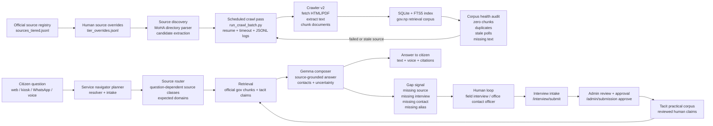

# PreVillage RAG Architecture For Video

Working claim:

> PreVillage is not a chatbot over a pile of PDFs. It is a service-navigation loop: watch official sources, crawl and index changes, audit the corpus, route each question to the right source class, expose uncertainty, collect missing practical knowledge from humans, review it, and feed it back into retrieval.

## What We Can Say Safely

- The source registry is data-driven. `corpora/sources_tiered.jsonl` stores official Nepal-government sources with tier, status, and `poll_interval_hours`.
- Human-reviewed source patches live separately in `corpora/tier_overrides.jsonl`, so source priority and corrections are not hard-coded one-off fixes.
- MoHA office discovery exists. `scripts/seed_moha_office_sources.py` parses official MoHA directory/contact pages, normalizes broken office links, probes domains, and appends idempotent source additions.
- Broad crawling is resumable. `scripts/run_crawl_batch.py` runs one source at a time with timeouts, JSONL logs, resume support, per-source stats, indexing, and FTS sync.
- Corpus health auditing exists. `scripts/corpus_health_audit.py` reports active documents without chunks, duplicate canonical URLs, empty/zero-text documents, missing extracted files, FTS count, and latest poll cycle data.
- The live answer path is planner-first. `server/navigator.py` emits `service_navigator_planner_v1` with case frame, missing slots, follow-up questions, source classes, expected domains, retrieval query, and gaps.
- Retrieval is split between official `.gov.np` chunks and reviewed tacit/human practical claims. `server/main.py` loads `TACIT_DIR`, ranks tacit claims, labels them as interview/practical sources, and feeds them before government chunks when relevant.
- Human practical knowledge has an implemented intake/review path: `/interview/submit`, `/admin/submissions`, `/admin/submission/{sid}/approve`, and `/admin/tacit/reload`.
- The model is asked to answer from source IDs and to say what is missing. The current product rule is service navigator behavior, not generic RAG Q&A.

## Wording To Avoid

- Do not say a production cron/supervisor is fully deployed unless we capture proof of an installed cron/systemd timer.
- Say "cron-capable scheduled refresh" or "scheduled maintenance loop" for the video unless we wire and show the timer.
- Do not claim the failed 2026-05-13 v5 SFT adapter is powering the demo. Say RAG and planner behavior are the load-bearing system.
- Do not imply synthetic interviews are real. Real Jiri interviews are valid footage/source material; synthetic scripts are only bootstrap/dev data.
- Do not imply the Raspberry Pi runs the full national RAG corpus unless the local corpus is actually copied there. Safer claim: local Gemma E2B can run onsite as the edge/intake/composer fallback, and an office computer can host the local source index.

## Architecture Diagram



## The Self-Healing Story

Self-healing does not mean the model guesses better. It means the system notices when its evidence base is broken and repairs the evidence path.

1. Every official office/source is tracked as a registry row with tier, status, and intended poll cadence.
2. A scheduled crawl pass polls sources one by one, with a timeout so one bad government site cannot freeze the whole refresh.
3. Each source writes a JSONL record with before/after document and chunk counts.
4. Indexing updates SQLite chunks and FTS, so retrieval sees newly extracted text.
5. The corpus health audit checks for pages that were fetched but not chunked, PDFs with no extracted text, duplicate live URLs, missing extracted files, and stale poll/index state.
6. Failed/stale sources go back into targeted recrawl rather than waiting for a human to notice a bad answer.
7. At query time, the planner also emits gaps when the resolved case expects a source/contact/interview that retrieval cannot support.

Short video line:

> The RAG heals at the evidence layer. If a page is fetched but not searchable, if a local office source is missing, or if practical room-level knowledge is absent, the system records the gap and routes it back into crawl, review, or human collection.

## The Human-In-The-Loop Story

Official websites tell the law and public notices. Humans tell the practical path: which room, which counter, what the officer actually checks, what changed last week but is not published yet.

Implemented loop:

1. Field interview or office/user feedback is submitted through the interview form.
2. Admin reviews the submission.
3. Approval transcribes the answers and writes reviewed tacit-knowledge JSONL records.
4. `admin/tacit/reload` reloads the tacit retriever without requiring a full government recrawl.
5. During retrieval, tacit claims are labeled as practical interview sources with role, confidence, and provenance, then combined with official government chunks.

Product rule:

> Official sources remain legal authority. Reviewed human sources become practical evidence. If they conflict, the answer should say both and expose uncertainty.

## Query-Time Flow

1. User asks in Nepali, Roman Nepali, English, or voice.
2. ASR converts speech to text when needed.
3. The service navigator resolves service, action, office, district, municipality, ward, case type, and missing slots.
4. If the case is ambiguous, the system asks a compact follow-up instead of pretending it knows.
5. Source router selects different source classes for contact questions, fees, forms, complaint handoffs, legal rules, or local office paths.
6. Retrieval gets official chunks and reviewed tacit/practical claims.
7. Gemma composes a grounded answer from source IDs only.
8. TTS turns the answer back into speech for kiosk or WhatsApp voice.

## What Judges Should Understand

The gap in Nepal is not only "no website." The deeper gap is tacit routing knowledge:

- Which office has jurisdiction?
- Which room/counter handles the case?
- Which document actually gets rejected?
- Which phone number is current?
- Which official page exists but is not indexed or searchable?
- Which local rule is real but not published clearly?

PreVillage attacks that gap with a loop, not a single model:

- crawl official websites;
- measure source health;
- route questions by government-service intent;
- admit uncertainty;
- collect field interviews;
- review human claims;
- make the next citizen's path easier.

## Video Shot List For This Architecture

Capture these as fast, legible inserts. They do not need long screen time; each can be 1-3 seconds.

1. Source registry:
   - Show `corpora/sources_tiered.jsonl`.
   - Highlight `source_id`, `domain`, `tier_guess`, `poll_interval_hours`, `status`.

2. Human-reviewed source overrides:
   - Show `corpora/tier_overrides.jsonl`.
   - Highlight a `promote`, `patch`, or `add` record.

3. MoHA source discovery:
   - Terminal: `python3 scripts/seed_moha_office_sources.py --help`.
   - Better: show the script header and MoHA directory parsing lines.

4. Resumable crawl:
   - Terminal dry run:
     ```bash
     python3 scripts/run_crawl_batch.py --dry-run --limit 12
     ```
   - Or show a real JSONL crawl log with `phase: source_done`, `docs_delta`, `chunks_delta`, and `timed_out`.

5. Corpus health:
   - Terminal:
     ```bash
     python3 scripts/corpus_health_audit.py --sample-limit 8
     ```
   - Show fields like `active_docs_without_chunks`, `duplicate_canonical_urls`, and `fts_chunks`.

6. Admin stats:
   - Browser or terminal: `/admin/info`.
   - Show `retriever_gov`, `retriever_tacit`, and chunk/source counts.

7. Planner-first retrieval:
   - Use `/retrieve` with a question like "Kirtipur company PAN ko lagi kun IRD jane?"
   - Show planner fields: `missing_slots`, `source_classes`, `expected_domains`, `gaps`.

8. Human loop:
   - Show Jiri interview footage.
   - Show `/interview` form.
   - Show `/admin/submissions` then approval/reload if demo-safe.

9. Citizen-facing result:
   - Show `/kiosk`, `/chat`, or WhatsApp voice flow.
   - Keep the answer grounded: "known / uncertain / contact / source".

## 25-Second Video Section

Use around the technical middle of the 3-minute film.

**VO:**

> We did not build this as a question-answering toy. Behind the interface is a registry of government sources, a crawler that can revisit offices on schedule, and a health audit that catches pages that were fetched but never became searchable. Then the planner asks: what service is this, which office owns it, what location is missing, and which source class should be trusted?

**VO:**

> But Nepal's real process is not always written down. So interviews become reviewed practical sources: who sends you to which room, what document gets rejected, which number still works. If the system lacks that evidence, it records the gap instead of hallucinating.

**On-screen text:**

> Official sources + reviewed human knowledge + gap logging = service navigation.

## Build Gap To Close Before Final Demo

These are worth doing if time allows:

- Add one visible "RAG Health" panel to admin/kiosk showing source count, chunk count, tacit claim count, last crawl, and last audit summary.
- Add a tiny gap log UI or JSONL sink if current planner gaps are not persisted.
- Wire one real cron/systemd timer on the demo server, then capture `systemctl list-timers` or `crontab -l`.
- Create one staged gap-to-human demo: ask a question the system cannot fully answer, show the missing contact/practical gap, then show a contact officer/interview record becoming a tacit source.
- Prepare one deterministic architecture animation from the Mermaid diagram for the video.
